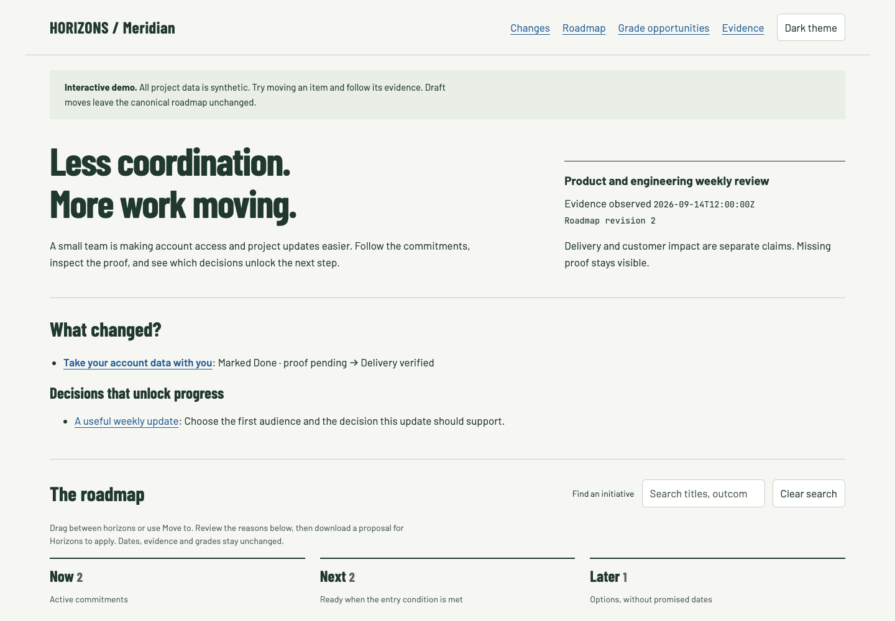

# /horizons — the Horizons roadmap builder

**Turn your repo, tickets and planning notes into a roadmap people can trust.**
See what shipped, what is next and what needs a decision, with evidence behind
every claim. Return next week and update the same roadmap without losing the
reasoning behind it.

For technical founders and product/engineering leaders preparing recurring
stakeholder reviews. Works with the project sources your agent can already read.

[Try the interactive demo](https://brandonellis.github.io/horizons-skill/) ·
[See the before view](demo/before.html) · [Watch the walkthrough](demo/walkthrough.webm) ·
[Read the evaluation results](evals/RESULTS.md)

[](https://brandonellis.github.io/horizons-skill/)

All demo content is invented. The example shows an account export moving from
“Marked Done, proof pending” to “Delivery verified” while customer impact remains
unmeasured. You can inspect its sources, move initiatives, and see which tickets
address the next grade gate. Draft moves do not change the shared demo.

## Get your first roadmap

For Claude Code:

```sh
git clone https://github.com/brandonellis/horizons-skill.git ~/.claude/skills/horizons
```

Then ask:

```text
/horizons Create a local Now/Next/Later roadmap from this repo and its issues
for our weekly product and engineering review. Keep unknowns visible.
```

Horizons resolves the source scope, builds a local artifact, and checks its data
and links. Ordinary creation requires no grading contract, runtime access,
publication account or extra browser installation. Material unresolved choices
still get a question; settled choices are reused. Duration depends on the project
and available model; see measured runs rather than a promised completion time.

Two requests that make it useful every week:

```text
/horizons refresh the existing roadmap. Show what shipped, what still lacks
proof, and the decisions that would unlock progress.

/horizons Move Weekly digest to Now because leadership committed to it.
Record that planning decision and preserve the existing evidence and grades.
```

## A roadmap you can question

- **Follow the evidence.** Open an initiative to see its customer problem,
  intended outcome, success measure, delivery proof and measured result.
  A ticket marked Done is not automatically verified delivery or customer impact.
- **See what changed.** Refresh compares source-backed delivery, evidence,
  decisions and impact with the previous revision. Missing proof stays visible.
- **Move work deliberately.** Drag between Now, Next and Later or use the keyboard
  accessible Move to selector. Review the reasons and download a proposal, then
  ask Horizons to apply it to the canonical artifact. The browser explicitly
  distinguishes unsaved drafts from saved decisions. No tracker edits occur.
- **Find the work that could raise a grade.** Ask for grade opportunities against
  an existing assessment. See exact criteria, proof needed, dependencies and
  shared gates. A component improvement may leave the overall grade unchanged.
  Projections are conditional; unknown production evidence remains Incomplete.
- **Keep the history.** Canonical path, planning decisions, original assessment
  baseline and prior grades persist. Refresh cannot silently move commitments.

## Choose a workflow

| Request | Result |
|---|---|
| `create` | Local, ungraded Now/Next/Later roadmap |
| `<artifact-url>` | Read and update the existing canonical artifact |
| `refresh` | Evidence delta and same-artifact update; relevant reassessment when already graded |
| `move` | Reviewed horizon changes with reason and append-only movement history |
| `priorities` | Tickets and proof that could improve existing grades, separate from business priority |
| `gantt` | Explicitly requested timeline with sourced dates and an unscheduled shelf |
| `wsjf [<source>]` | Optional human-confirmed cost-of-delay ranking |
| `grade` / `score` | Assessment against the established baseline and rubric, with immutable history |
| `help` | Workflow explanations; no artifact work |

Natural-language questions receive answers in conversation. They do not create
or modify a page. `score` means maturity assessment; `wsjf` means prioritization.
A plain roadmap never acquires a grade automatically.

The lightweight renderer supports its own versioned model. Existing custom,
Gantt and assessed artifacts retain their established workflow and visual world;
the starter refuses to overwrite legacy/assessed HTML. Grade-opportunity views
can display recorded assessments without issuing new ones.

## Packages and local demonstration

Download `horizons-claude-code.tar.gz` or `horizons-portable.tar.gz` and its SHA-256
file from the [latest release](https://github.com/brandonellis/horizons-skill/releases/latest).
The portable archive removes Claude Code's `argument-hint` field automatically;
no manual frontmatter edit is needed. Install into the chosen host's documented
skill directory. Archive structure and its local Node pipeline are tested;
behavioral results name the hosts and models actually exercised.

To build the synthetic example with an existing Node installation:

```sh
node scripts/roadmap-pipeline.mjs build /tmp/meridian.html demo/roadmap.json
node scripts/roadmap-pipeline.mjs refresh /tmp/meridian.html demo/refresh.json
node scripts/roadmap-pipeline.mjs verify /tmp/meridian.html
```

Open `/tmp/meridian.html` in a browser. These commands need no dependencies,
credentials or network access. Fonts can load from Google Fonts in the browser;
readable fallback fonts remain when offline. The page contains no analytics.

### Upgrading from `/roadmap`

The command was `/roadmap` through v1.14.0. Rename the existing skill directory
to `horizons` and set its origin to this repository; do not clone over an existing
installation. Pages, baselines and assessment history retain their identity.

## What executes and what stays private

Cloning installs no hook, dependency or binary. The optional Node pipeline reads
selected JSON and writes the named local HTML plus a temporary recovery checkpoint.
It validates a candidate before atomic replacement and refuses stale proposals or
concurrent updates. It never edits issue trackers or publishes by itself.

Generated pages contain local JavaScript for filters, deep links, theme controls
and movement proposals. No model credentials, analytics or runtime access are
embedded. Source content can still be sensitive: publication follows the existing
audience, destination and content authorization. A first publication names its
contents before approval. Hidden sections are not access controls.

Grading reads tickets and code, with environment-specific evidence for operational
claims. Existing deterministic/qualitative methods, independent-review requirements,
scalability lenses, original baselines and history locks remain in force. Missing
runtime proof means unverified, not an observed failure. Model/provider selection
stays with the user and host; smaller models do not acquire grading authority by
being cheaper. See [the execution contract](references/execution-contract.md).

## Contents

- `AGENTS.md` carries repository-maintenance instructions, including the required
  release handoff. It does not change what running the skill does to a project.
- `evals/` holds the scenario suite: build, refresh, grade, timeline, and one
  where the right answer is prose and no artifact. Each scenario names the
  failure it exists to catch and what fails it outright. Maintainer-facing, not
  linked from `SKILL.md`, and never loaded during a run. `evals/README.md` says
  how to run one by hand; `scripts/evals.test.mjs` checks the scenario files.
- `references/feature-rollups.md` defines source-backed feature membership,
  completed capability work and fixes, original requirements, follow-ups and
  deduplicated credit. `scripts/feature-rollups.mjs` and
  `scripts/render-feature-rollups.mjs` build and render those groups with
  `assets/feature-rollups.css`.
- `references/stakeholder-story.md` owns audience inheritance, evidence-backed
  progress storytelling, visual retention and safe audience-specific exports.
- `assets/stakeholder-visuals.css` supplies delivery bars, baseline-cohort marks,
  linked win lists and the responsive Gantt. Use with the progress shell assets.

- `SKILL.md` is the skill itself: modes, the four phases, the decided rules.
- `references/artifact-views.md` is the shared-model/view contract, copy-ready
  accessible tabs, responsive/print behavior and interaction verification.
- `references/progress-layout.md` is the progress-first composition, scope and
  provenance rules, reusable asset hooks and browser acceptance checks.
- `assets/progress-shell.css` and `assets/progress-shell.js` implement the
  responsive comparison layout, scope and format selectors, shared roadmap
  filters, deep-link reveal and printable archived evidence. Inline them in
  generated artifacts with the tab controller from `artifact-views.md`.
- `references/page-anatomy.md` is the content spine and the outcome-led NNL
  design: active commitments, entry conditions, options and movement history.
- `references/gantt.md` is the timeline design, date provenance, baseline vs
  current commitments, milestones, scheduling coverage and slip handling.
- `references/wsjf.md` is the scoring layer: worksheet format, validation,
  rendering rules.
- `references/report-card.md` is `grade` mode: the auditor fan-out, the five
  dimensions, the twin verdict, the measurement band, the versioned
  instrument, the letter-move classes, the scale ladder, the learning-loop
  lens for projects that run models or agents, the exception register, the
  rules for filing findings, and the re-test of the previous card's findings
  that produces the panel's own error rate.
- `references/grade-anchors.md` is the calibration sheet `grade` carries into
  every auditor prompt: letter anchors per dimension, plus the instrument
  and coverage manifest templates.
- `references/baseline-ledger.md` owns initial-baseline resolution, legacy
  migration, immutable assessments, deterministic roll-up, A+ gates, safe
  persistence and rebaseline approval.
- `references/interaction-layer.md` is the CSS/JS the published page ships, with an
  adaptation contract (rename the hooks, keep the roles).
- `references/writing-floor.md` is the prose floor: hard rules, banned phrases,
  and the tests the finished page must pass.

- `references/first-run.md` documents the dependency-free starter pipeline and versioned model.
- `references/full-workflow.md` preserves the complete established/custom/graded workflow, loaded only when needed.
- `references/refresh-summary.md` makes source-backed changes the refresh headline.
- `references/outcome-evidence.md` separates customer problems, delivery and measured results.
- `references/roadmap-moves.md` documents accessible draft moves, review and safe application.
- `references/grade-opportunities.md` maps tickets and proof to existing grade gates.
- `scripts/roadmap-model.mjs`, `render-starter.mjs` and `roadmap-pipeline.mjs` validate, render, stage and atomically save starter artifacts.
- `scripts/grade-opportunities.mjs` derives conditional grade plans without changing assessments.
- `scripts/package-skill.mjs` builds tested Claude Code and portable archives with checksums.
- `scripts/summarize-evals.mjs` reports local journey measurements without treating unknowns as passes.
- `references/run-budget.md` bounds delegation and retries across the whole run,
  shares raw source collection while preserving independent audits, and reports
  missing usage as unknown. `scripts/summarize-usage.mjs <ledger.json>` summarizes
  private per-call telemetry; it does not enforce host spending or measure plan allowance.
- `references/model-routing.md` supplies default Codex and Claude child-model
  routes, including available Codex 5.6 alternatives. Selected leads and explicit
  child assignments are preserved; unpinned roles use same-provider defaults
  without a profile-selection prompt. These starting routes require task-specific
  qualification before being treated as proven.
- `demo/` contains synthetic inputs, a before/after artifact, screenshot and recorded walkthrough; `docs/index.html` is its public demo edition.
- `docs/usability-study.md` defines real-user tasks and measurements; no participant findings are claimed.

A new reference or mode moves this list and the usage table in the same commit.
Whether the repo matches its own contents list is the first thing a reviewer
checks, and it is the cheapest possible way to fail: a reference the README does
not mention reads as undocumented content, not as an oversight.

## Maintainer validation and optional artifact QA

Read [the behavioral results](evals/RESULTS.md) before relying on unattended
execution. The release evaluations include unresolved model failures, including
Haiku changing horizons during a delivery-only refresh. Passing helper tests
does not prove an agent respects scope, clarification or artifact ownership.
The 2.1.1 evaluations exposed a rewritten history lock that still passed a
regenerated manifest. Update verification now compares against a hash retained
before writes: `--history-lock-sha256 ORIGINAL_HASH` (or the API option
`expectedHistoryLockSha256`). Without it, the verifier reports history-lock
preservation as `not-checked`. See the [update verification procedure](references/executable-grading.md#verify-before-publishing).

Maintainer regression tests protect the shared helpers. Browser-specific checks
need an existing browser-testing session; exported helpers take a page object
and do not provision one. These are not installation or ordinary usage steps.
For maintainer work or artifact QA when tools are available, use the bounded
scenario checks in `artifact-views.md`, `progress-layout.md` and `baseline-ledger.md`:
keyboard/deep-link/filter/print behavior, unchanged-evidence grading, reopening,
missing access, scope changes and explicit rebaseline. The repo does not install
a test framework. Claude Code's existing `argument-hint` frontmatter is intentional;
generic skill validators that only accept the cross-client core may reject it.

## Versioning

Semver via annotated git tags and published GitHub Releases; see `CHANGELOG.md`.
**Committing and pushing skill changes includes cutting a release**, unless the
maintainer explicitly requests an unreleased change. A pushed commit or tag alone
is not a completed release. Several implementation commits can ship together.

1. Fetch remote branches and tags, then inspect the published releases and all
   changes since the last released version. Preserve concurrent work.
2. Choose the next version: patch for compatible fixes, minor for compatible new
   capabilities, major for breaking changes. Never reuse an existing version.
3. Run `node --test scripts/*.test.mjs` and `git diff --check`. Review the release
   diff for private project data and update the relevant documentation.
   Run changed behavioral scenarios on more than one model and complete the
   [lead-model grading evaluation](evals/README.md#release-model-coverage),
   recording outcomes and limitations before release.
4. Move the shipped `Unreleased` entries into a dated version section in
   `CHANGELOG.md`. Commit the release changes and annotate that commit with
   `git tag -a vX.Y.Z -m "Release vX.Y.Z"`.
5. Push the intended branch and tag without force, preferably atomically:
   `git push --atomic origin main refs/tags/vX.Y.Z`.
6. Publish the GitHub Release for that tag with the version's changelog notes:
   `gh release create vX.Y.Z --verify-tag --title "vX.Y.Z" --notes-file <notes-file>`.
   Normal stable releases must not remain drafts or prereleases.
7. Verify the remote tag's peeled commit matches the intended release commit,
   and the published GitHub Release points to that tag. Report the released
   version; if publication fails, state the incomplete step rather than claiming
   the release shipped. Resume safely instead of force-moving a published tag.

This is a maintainer workflow only. Installing or running the roadmap skill
does not create commits, tags or releases in the project being assessed.

### Learning and evaluations

Discovered agents and loops can appear as a leadership learning map, a four-stage
evidence trace and an evaluation matrix. Optional WebGL exploration uses the same
records and stable positions. Print, no-JavaScript and graphics-failure paths keep
evidence readable. The shared renderer presents recorded judgments and never
invents relationships or issues a grade. See
[learning-system guidance](references/learning-system.md) and the
[synthetic fixture](evals/fixtures/learning-system/README.md).

### Assessment freshness and connected loops

Keep the incumbent Now/Next/Later and Gantt layout, palette and typography when
clarifying grades or learning. `renderGradeRegister` separates a current result
from an older dated letter and names the next required proof.
`renderLearningConnections` separates directional handoffs between loops from
the four stages inside one loop and from evidence of a feedback return. It
includes selectable evidence, optional 3D, explicit illustrative playback and
print/no-JavaScript records. Neither renderer computes grades or infers traffic.

See the [synthetic example](evals/fixtures/evidence-clarity/example.html),
[grade guidance](references/progress-layout.md) and
[connection schema](references/learning-system.md). The existing renderers remain
available; these are optional compositions using the host's visual tokens.
