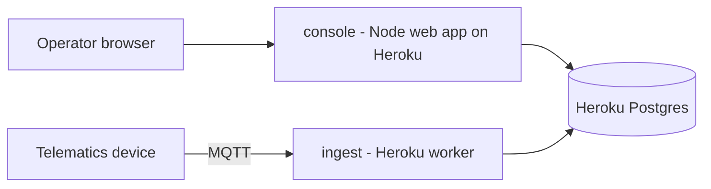

# Container view

Last updated: 2026-05-02

```mermaid
flowchart LR
  operator[Operator browser] --> console[console - Node web app on Heroku]
  device[Telematics device] -->|MQTT| ingest[ingest - Heroku worker]
  console --> db[(Heroku Postgres)]
  ingest --> db
```

Two deployables, both on Heroku, sharing one Heroku Postgres database.
